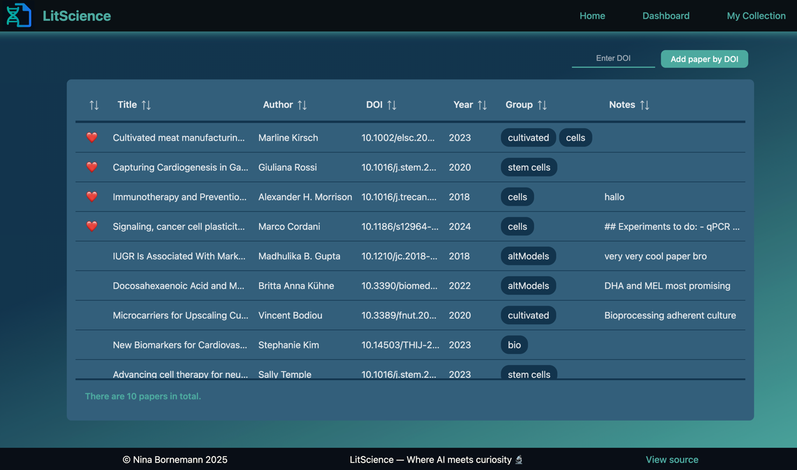
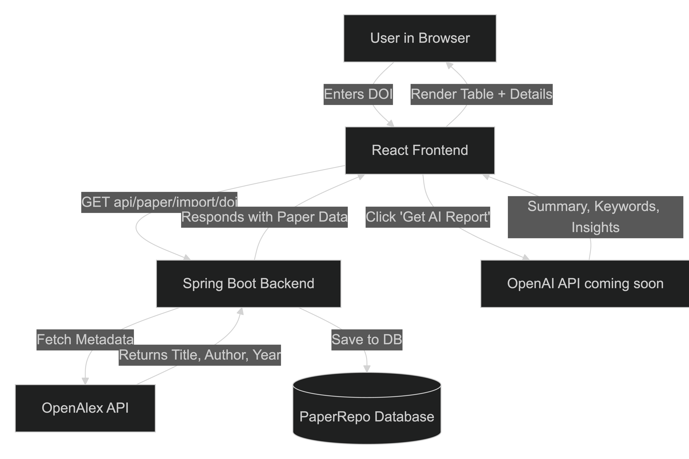

# 🧬 LitScience 🧪

**LitScience** is an intelligent literature assistant for 
researchers, students, and curious readers.  
It lets you import scientific papers by DOI, organize them with 
tags, favorite key readings, and (soon) analyze papers with AI for 
summaries and insights.

This project is a **full-stack capstone** combining a Spring Boot 
backend, React + TypeScript frontend, and external APIs like 
**OpenAlex** (for metadata) and soon **OpenAI** (for summaries & analysis).

---
# 🚧 Status
> **In Progress — Capstone 2025**

Core CRUD and OpenAlex integration are implemented.  
Upcoming:
- 🧩 **OpenAI API integration** for generating smart summaries and key research insights
- 📄 **PDF “drop-in” uploads** to extract and parse content directly from files
- 🎨 **Expanded UI dashboard** for citation management, search, and analytics

---

## 🛠️ Tech Stack

### 🖥️ Frontend
- **React + TypeScript (Vite)**
- **PrimeReact** for advanced data tables
- **RSuite** for tag management and UI components
- **Axios** for API communication
- **React Router v6** for client-side navigation
- **@uiw/react-md-editor** for Markdown-based notes

### 🧩 Backend
- **Spring Boot (Java 21)**
- **RESTful architecture with MVC pattern**
- **OpenAlex API integration** (via `RestClient`)
- **Planned:** OpenAI API (summarization, keyword extraction, flashcards)
- **Planned:** PDF parsing service for file uploads

### 🗄️ Database
- Uses `PaperRepo` (Spring Data JPA or MongoRepository — depending on setup) for persistence

---

## 🏛️ Architecture Overview

## 📚 Features  
✅ Import by DOI – Fetch metadata (title, author, year) via the OpenAlex API  
✅ List & Filter Papers – View all papers and filter by group  
✅ Favorites & Tags – Organize your research easily  
✅ Markdown Notes – Write and save formatted notes per paper  
✅ Dashboard – Quick stats: total papers, groups, favorites  

## 🔮 Coming Soon  
### 🚀 OpenAI Integration  
Use GPT-based analysis to summarize, extract keywords, and auto-generate learning notes.

### 📄 PDF Drop-Ins
Upload scientific papers directly — the system will extract text and metadata automatically.

### 🎓 Smart Dashboard
Visualize your reading trends, favorite authors, and keyword heatmaps.

## 🧠 API Endpoints (Backend)
Method	Endpoint	Description
GET	/api/paper	Get all papers or filter by group
GET	/api/paper/{id}	Get a paper by ID
GET	/api/paper/import/{doi}	Import paper by DOI via OpenAlex
POST	/api/paper	Add a new paper manually
PUT	/api/paper/{id}	Edit a paper
PUT	/api/paper/{id}/favorite	Toggle favorite
PUT	/api/paper/{id}/group	Edit groups
DELETE	/api/paper/{id}	Delete a paper

## 🚀 Getting Started
### Backend

> git clone https://github.com/nina-bornemann/LitScience.git  
> cd LitScience/backend  
> ./mvnw spring-boot:run  

Server runs at:
👉 http://localhost:8080

### Frontend
> cd frontend
> npm install
> npm run dev

Frontend runs at:
👉 http://localhost:5173 (default Vite port)

## 💡 Example Flow
- User enters a DOI in the input field

- Frontend calls GET /api/paper/import/{doi}

- Backend fetches metadata from OpenAlex

- Paper appears instantly in the PaperTable

- User can edit tags, notes, and mark favorites

- (Future) User clicks “Get AI report” → OpenAI summarizes the paper

👩‍🔬 Nina  
☕️ Capstone Project — 2025  
🧬 Turning scientific chaos into structured curiosity.

