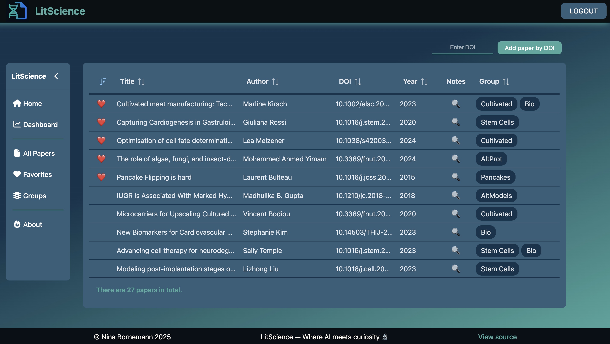

# 🧬 LitScience 🧪

     

**LitScience** is an intelligent literature assistant for 
researchers, students, and curious readers.  
It lets you import scientific papers by DOI, organize them with 
tags, favorite key readings, and analyze papers with AI for 
summaries and insights.

This project is a **full-stack capstone** combining a Spring Boot 
backend, React + TypeScript frontend, and external APIs like 
**OpenAlex** (for metadata) and soon **OpenAI** (for summaries & analysis).

---
# 🚧 Status
> **In Progress — Capstone 2025**

Core CRUD, OpenAi and OpenAlex integration are implemented.  
Upcoming:
- 📄 **PDF “drop-in” uploads** to extract and parse content directly from files
- 🎨 **Expanded UI dashboard** for citation management, search, and analytics

---

## 🛠️ Tech Stack

### 🖥️ Frontend
- **React + TypeScript (Vite)**
- **RSuite** for tag management and UI components
- **Axios** for API communication
- **React Router v6** for client-side navigation
- **@uiw/react-md-editor** for Markdown-based notes
- **Protected Routes** using React Router authentication guards to ensure only logged-in users access main features
- **OAuth Login** via GitHub — implemented via backend OAuth2 client and frontend redirect flow
- **PrimeReact** for advanced data visualization (table and charts)

### 🧩 Backend
- **Spring Boot** Java 21
- **RESTful** architecture with MVC pattern
- **OpenAlex API** integration via `RestClient`
- **OpenAI API** summary of key findings and methods, keyword extraction
- **OAuth2 Login** with GitHub — handles user authentication and redirects to frontend after login
- **Planned:** PDF parsing service for file uploads

### 🗄️ Database
- Uses `PaperRepo` (Spring Data JPA or MongoRepository — depending on setup) for persistence

---

## 🏛️ Architecture Overview

## 📚 Features  
✅ Import by DOI – Fetch metadata (title, author, year) via the OpenAlex API  
✅ List & Filter Papers – View all papers and filter by group  
✅ Favorites & Tags – Organize your research easily  
✅ Markdown Notes – Write and save formatted notes per paper  
✅ Dashboard – Quick stats: total papers, groups, favorites  
✅ Interactive Pie Chart Dashboard – Visual overview of paper distribution by group  
✅ Use ChatGPT-based analysis to summarize, extract keywords, and auto-generate learning notes    
✅ closable Sidebar for easy navigation  
✅ OAuth2 GitHub Login – Secure login flow with redirect and logout  
✅ Protected Routes – Only accessible after successful authentication  

## 🔮 Coming Soon   

### 📄 PDF Drop-Ins
Upload scientific papers directly — the system will extract text and metadata automatically.

### 🎓 Smart Dashboard
Visualize your reading trends, favorite authors, and keyword heatmaps.

## 🧠 API Endpoints (Backend)
Get all papers or filter by group    
> GET	  /api/paper  
> GET     /api/paper?group={groupName}

Get a paper by ID
> GET	    /api/paper/{id}

Import paper by DOI via OpenAlex
> GET	    /api/paper/import/{doi}

Add a new paper manually 
> POST	  /api/paper

Edit a paper  (notes, favorites, groups)
> PUT	    /api/paper/{id}	  
> PUT	    /api/paper/{id}/favorite	  
> PUT	    /api/paper/{id}/group

Delete a paper  
> DELETE	/api/paper/{id}	  

Create AI generated report
> POST   /api/paper/{id}

Authentication

> GET /login/oauth2/code/github  
> GET /logout  
> GET /user — returns logged-in user info  

## 🚀 Getting Started
### Backend

> git clone https://github.com/nina-bornemann/LitScience.git  
> cd LitScience/backend  
> ./mvnw spring-boot:run  

Server runs at:
👉 http://localhost:8080

### Frontend
> cd frontend
> npm install
> npm run dev

Frontend runs at:
👉 http://localhost:5173 (default Vite port)

## 💡 Example Flow
- User logs in via GitHub OAuth to access protected dashboard routes  

- User enters a DOI in the input field

- Frontend calls GET /api/paper/import/{doi}

- Backend fetches metadata from OpenAlex

- Paper appears instantly in the PaperTable

- User can edit tags, notes, and mark favorites

- User clicks “Get AI report” → OpenAI summarizes the paper

## 🌱 Environment Variables

| Variable            | Description                               | Example                                                            |
|---------------------|-------------------------------------------|--------------------------------------------------------------------|
| MONGO_DB_URI        | connection String for databank connection | mongodb+srv://[username:password@]host[/[defaultauthdb][?options]] |
| OPENAI_API_KEY      | for AI generated reports                  | sk-[22 characters]BlbkFJ[20 characters]                            |
| GITHUB_ID           | needed for Login via OAuth                | [20 characters]                                                    |
| GITHUB_SECRET       | needed for Login via OAuth                | [40 characters]                                                    |
| DEFAULT_SUCCESS_URL | to redirect after successful login        | http://localhost:5173                                              |

👩‍🔬 Nina  
☕️ Capstone Project — 2025  
🧬 Turning scientific chaos into structured curiosity.

